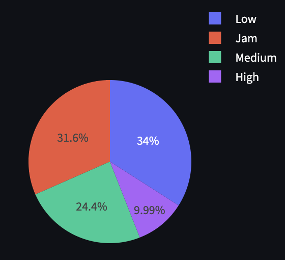
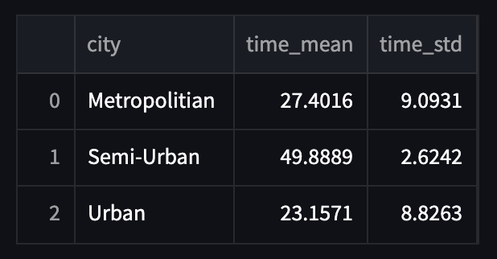

# Made in Asia Marketplace 🍴
## Visualization and analysis of Made in Asia company data by Streamlit

# 1.0 Business Problem 

Made in Asia is a technology company that created an app that connects restaurants, delivery people and people. Through this application, it is possible to order a meal at any registered restaurant, and receive it in the comfort of your home by a delivery person also registered in the Made in Asia application.

The company conducts business between restaurants, couriers and people, and generates a lot of data about deliveries, types of orders, weather conditions, assessment of couriers, etc. Despite the delivery is increasing, in terms of deliveries, the CEO does not have complete visibility into the company's growth KPIs.

In this way, it is essential that someone is responsible for creating data solutions for delivery, but before training algorithms, the company needs to have one of the main strategic KPIs organized in a single tool, so that the CEO can consult and be able to make decisions simple but important.

The company has a business model called Marketplace, which seeks to mediate the business between three main customers: Restaurants, couriers and buyers. In this sense, the CEO would like to monitor growth metrics based on three different views:

On the company side:
- 1. Quantity of orders per day.
- 2. Quantity of orders per week.
- 3. Distribution of requests by type of traffic.
- 4. Comparison of order volume by city and type of traffic.
- 4. The amount of orders per delivery person per week.
- 5. The central location of each city by type of traffic.

On the delivery side:
- 1. The lowest and highest age of the couriers.
- 2. The worst and best condition of vehicles.
- 3. The average rating per courier.
- 4. Average rating and standard deviation by type of traffic.
- 5. The average rating and standard deviation by weather conditions.
- 6. The 10 fastest couriers by city.
- 7. The 10 slowest couriers by city.

From the restaurant side:
- 1. The amount of unique couriers.
- 2. The average distance to restaurants and delivery locations.
- 3. The average delivery time and standard deviation by city.
- 4. Average delivery time and standard deviation by city and order type.
- 5. The average delivery time and standard deviation by city and type of traffic.
- 6. The average delivery time during Festivals.

# 2.0 Business Assumptions

- The analysis was performed from data between 02/11/2022 and 04/06/2022
- The model adopted by the company is the Marketplace
- A dashboard based on three different views (Company, Deliveries and Restaurants) was built to monitor the company's growth metrics

## 2.1 Data Description

| Column            | Description                                                                                                                             |
| :---------------- | :-------------------------------------------------------------------------------------------------------------------------------------- |
| `ID`       | Customer Unique Identifier |
| `Delivery_person_ID` | Courier's Unique Identifier |
| `Delivery_person_Age` | Age of each Courier |
| `Delivery_person_Ratings` | Note from each Courier |
| `Restaurant_latitude` | Value of the latitude of each Restaurant |
| `Restaurant_longitude` | Value of the longitude of each Restaurant |
| `Delivery_location_latitude` | Latitude value of each Courier's location |
| `Delivery_location_longitude` | Longitude value of each Courier's location                                                                            |
| `Order_Date`         | Date each order was placed |
| `Time_Orderd` | Time each order was placed |
| `Time_Order_picked` | Time each order was delivered
| `Weatherconditions` | Weather Conditions |
| `Road_traffic_density` | Traffic Type |
| `Vehicle_condition` | Condition of each vehicle on a scale of 0 to 3
| `Type_of_order` | Type of each order placed |
| `Type_of_vehicle` | Type of each vehicle
| `multiple_deliveries` | If there was more than one order (1) or not (0) |
| `Festival` | Whether it was a festival period (Yes) or not (No) |
| `City` | type of each city
| `Time_taken(min)` | Time for each order to be delivered

# 3.0 Solution Strategy

The strategic dashboard was developed using metrics that reflect the 4 main visions of the company's business model:

- Overview
- Vision cities
- View countries
- Overview restaurants

Each view is represented by the set of metrics described in the Business Problem.

# 4.0 Insights

## 4.2 Top 3 Insights

### It was noted that there was a week in February when there were no orders, which suggests some hypotheses.

### The variation in requests by type of traffic has not changed significantly over time. In this sense, the types "Low" and "Jam" predominate in sales.

### Cities of the "Urban" type had the lowest average delivery time

# 5.0 The final product of the project

With the dashboard created, the CEO can now consult the dashboard via the Cloud, through the Streamlit platform and, therefore, a more agile and easier way for decision making.

The panel can be accessed through this link: https://luishmq-made-in-asia-mktp-home.streamlit.app/

# 6.0 Conclusions

The goal of this project is to create a set of charts and/or tables that best display the selected metrics for the CEO.

From the Company's point of view, we can conclude that the number of orders grew between week 06 and week 13 of 2022.

# 7.0 Lessons Learned
- Visualization and analysis of data with libraries such as plotly, matplotlib and seaborn
- Calculation of measurements such as latitude and longitude through theharsine library
- Possibility of agile and professional data query via Cloud Streamlit

# 8.0 Next steps
- Respond to new business hypotheses to better understand data and resource relationships and create new views to verify new relationships between data
- Create new filters
- Reduce the number of metrics
- Apply programming techniques to improve the performance of the created solution

